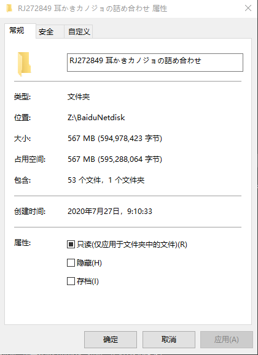
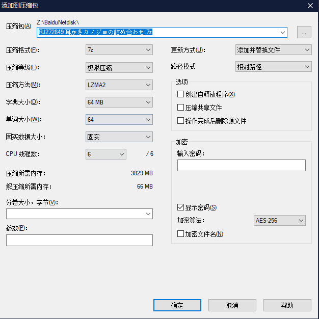
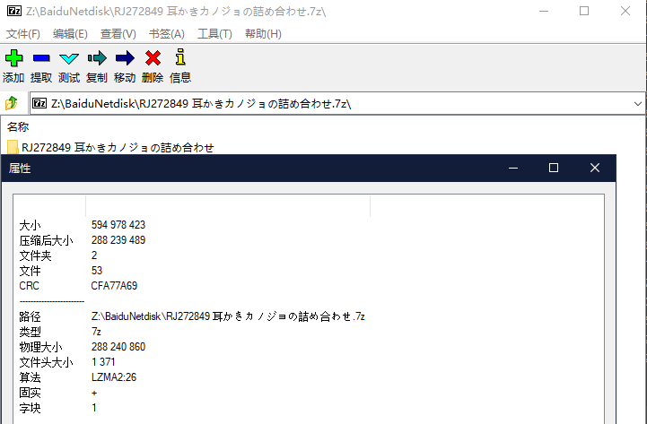
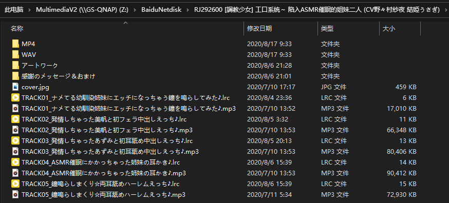
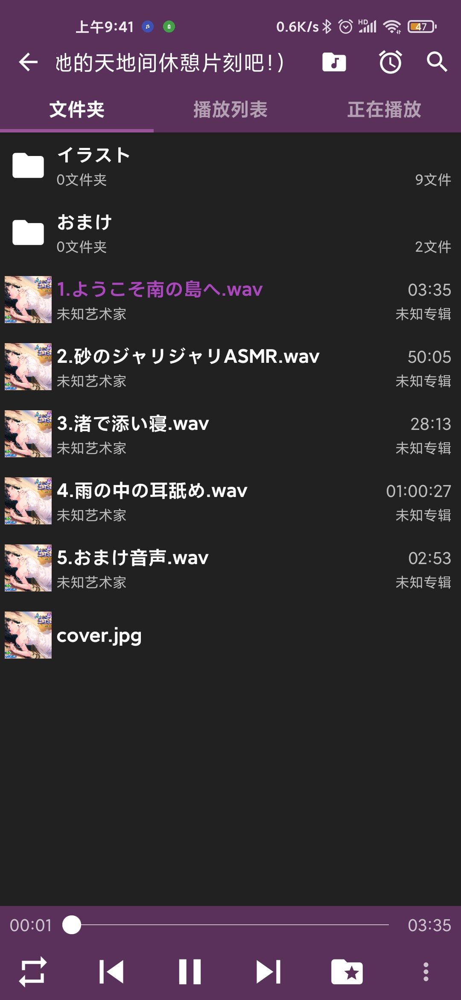
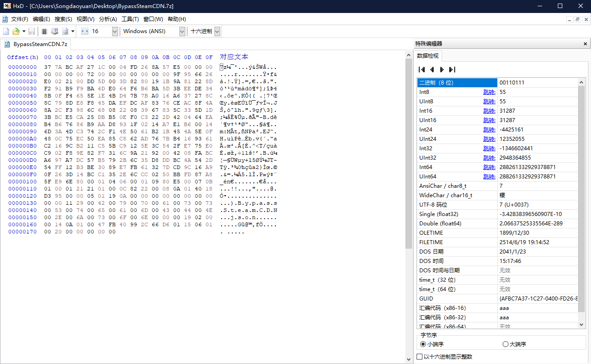
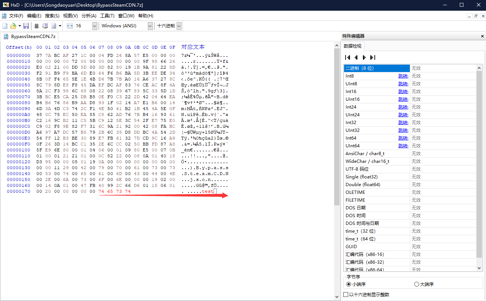
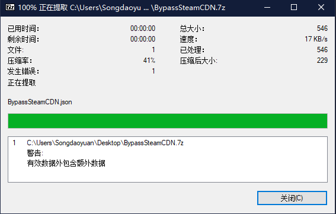

# 关于压缩文件

## 1. 如何提高压缩文件压缩率

使用先进的压缩格式和优秀的压缩算法，这里推荐使用7z格式和LZMA2算法

压缩软件推荐使用精简开源强大的[7Zip](https://www.7-zip.org/ "官网链接")

安装后选择文件右键，就可以看到7Z提供的压缩选项和CRC文件校验选项，我已经附上64bit的安装包在文件夹内，欢迎自取

例如：

RJ272849 耳かきカノジョの詰め合わせ 源文件567M

使用7z+LZMA2压缩后大小为274MB，压缩率接约50%

## 2. 文件名命名规范 AND 文件结构规范

为了使归档更加有序，推荐为汉化作品文件夹采用:

`RJ号+[社团名称]+作品中文译名+(CV名)`

的形式，例如

`RJ292600 [調教少女] 工口系统～ 陷入ASMR催眠的姐妹二人 (CV野々村紗夜 結姫うさぎ)`

值得注意的是，只要是符合这种形式就可以，尽量在文件名中保留相关的，有用的关键信息，每个关键区域间使用空格分隔，除了译名内符号，其余一律使用英文半角符号

文件结构树按社团提供的解压后文件树为准，若为轻量包或者仅WAV版本，亦或是包含MP4的版本，推荐使用如下文件树结构(可以根据自己需求增加或者删除文件夹)

其中的WAV和MP4文件夹均为可选，音频直接放置于文件夹根目录，将LRC重命名后和音频放在一起

若官方有手动创建插图文件夹则不做更改，否则手动创建`Illustration`文件夹将附赠的插图放置在内

同时，将包含有音频简介的JPG格式封面重命名为`cover.jpg`放置在根目录，方便使用WAV或者无法读取MP3内置封面的音乐软件读取插图信息

就像这样

可以看到即使是没法内嵌封面的WAV也正确读取到了封面图片

## 压缩的进阶知识

### 百度云是如何爆破文件的

首先每一个文件都可以通过摘要算法计算出一个独特的信息，就和指纹一样和每个人一一对应，文件也是

任何一个上传到了百度云的文件都会被百度计算md5信息，下次再有相同的文件上传，那就是急速秒传，扯远了

当然这样也可以被百度用于标记文件，被举报的压缩包(甚至包括未加密压缩包内的文件)会被百度记录md5信息，导致再次分享后链接秒爆

这时候怎么办呢，常见的做法是二压，但是压缩非常浪费时间，尤其是对于巨大的压缩文件来说

这个时候其实有个非常简单的小技巧，在计算机中，文件都是以二进制文件流的形式储存的，我们使用16进制阅读器打开任何一个压缩文件，可以得知一个文件由文件头+数据段+文件尾三部分组成

由于文件未存在边界分隔符，我们可以在结尾处再添加任意一点垃圾16进制信息，比如我这里插入了`74 65 73 74`，实际上也就是英文test

保存文件后就在完全没有重新压缩的情况下完成了对压缩包的文件指纹修改，而且最关键的是完全不会影响解压，只有一个无伤大雅的警告

这样就绕开了百度云的md5指纹检测，再配合上压缩密码就能避免在线解压，同时我们甚至可以在添加的信息内加入购买者的基础信息，对文件进行追踪，反向排查文件放流源

## 补充杂项

整理思路中，待补
